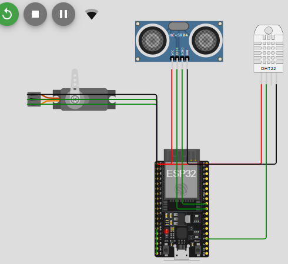
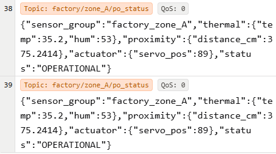
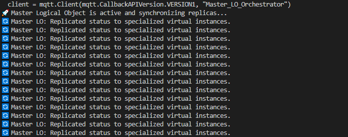
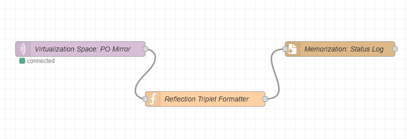

# Consolidated Digital Twin (cDT) for IoT Industrial Monitoring

This project implements a **Consolidated Digital Twin (cDT)** based on the architectural framework defined in the survey paper:

> *"Digital Twin in the IoT Context: A Survey on Technical Features, Scenarios, and Architectural Models"*  
> — Minerva et al.

The system bridges the **Physical Space (Atoms)** and the **Virtualization Space (Bits)** to create a persistent software counterpart featuring:

- ✅ Strong Entanglement  
- ✅ Reflection  
- ✅ Memorization  
- ✅ Replication & Specialization  
- ✅ Persistency  

---

# 🏗️ System Architecture: The Three-Space Model

## 1️⃣ Physical Space (The Atoms)

Using **Wokwi**, we simulated an industrial sensing unit that generates a continuous data stream (temperature, humidity, proximity) and reacts to remote actuation commands.

### 🔧 Components

| Component     | Role |
|--------------|------|
| ESP32        | Physical Object (PO) Controller |
| DHT22        | Thermal Attribute Sensor |
| HC-SR04      | Proximity/Distance Sensor |
| Servo Motor  | Actuator for Strong Entanglement feedback |

*Figure 1: Physical Object (PO) wiring and sensor integration.*

---

## 2️⃣ Virtualization Space (The Middleware)

The middleware layer handles the **Entanglement** between atoms and bits.

- **Broker:** HiveMQ Cloud  
- **Orchestration:** Python-based Master Logical Object (LO)

### 🔁 Reflection Property

The Physical Object mirrors its status to the cloud in real time using JSON format.

*Figure 2: Verisimilar representation of PO attributes in the cloud.*

---

### 🧠 Master LO Replication

A Python-based **Master Logical Object (LO)** orchestrates data distribution.  
It prevents overloading the physical device by replicating data into:

- Real-time monitoring stream  
- Historical logging stream  

*Figure 3: Master LO replicating status to specialized virtual instances.*

---

## 3️⃣ Application Space (The Bits)

The Application Space contains specialized services consuming LO data.

---

### A. 🧠 Cognitive Engine (Augmentation)

- Monitors the Real-Time LO  
- Applies autonomous logic  
- If temperature > 25°C → sends actuation command  
- Simulates cooling vent opening (Servo activation)

*Figure 4: Autonomous feedback loop triggering Strong Entanglement actuation.*

---

### B. 💾 Memorization Layer (Status Log)

Implemented using **Node-RED**.

- Captures object history  
- Stores data in persistent CSV file  
- Enables trend analysis & forensic inspection  

*Figure 5: Node-RED flow connecting Virtualization Space to the Memorization Status Log.*

---

# 🚀 Technical Features Implemented

- **Strong Entanglement**  
  Bidirectional communication between LO and PO (Servo control)

- **Promptness**  
  Negligible synchronization delay between PO and LO

- **Replication & Specialization**  
  Master Replica serving multiple application instances

- **Persistency**  
  LO maintains last known state even if sensors go offline

---

# 🛠️ Setup Instructions

## 1️⃣ Physical Layer
Load the code inside:

